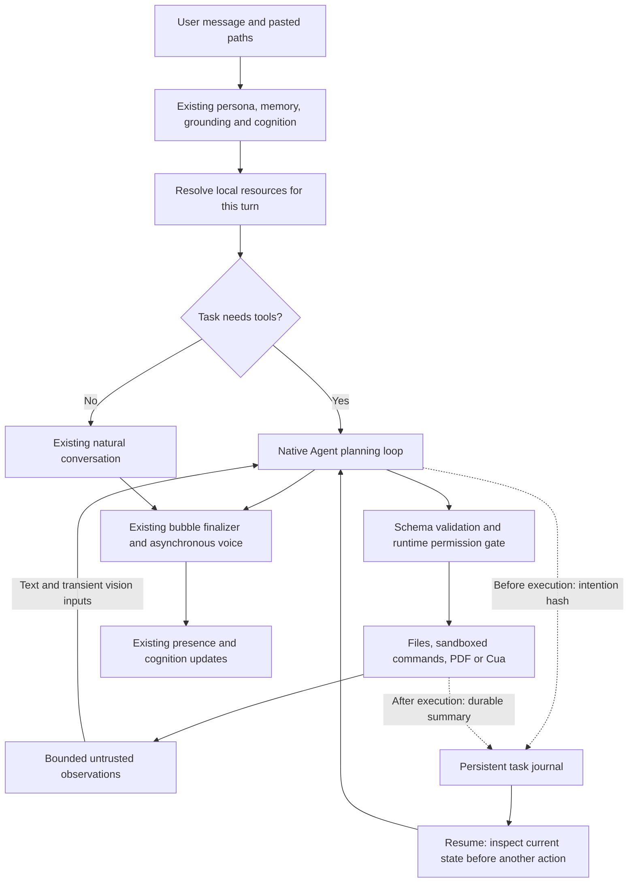

# Companion Local Agent Runtime v1

Implemented inside the existing Companion Core and CompanionMac. This change does not introduce another app or replace the persona model.

## Verified root cause and request chain

The active service was PID 17911 on `127.0.0.1:8770`, working in this repository. The initially supplied ChatGPT workspace is an empty Git shell. The request chain is `POST /v1/chat/completions → chat → processChat → buildInjectedMessages → upstreamChat`. Previously, local path strings had no resolver, and daily chat only selected the existing tool loop when the request explicitly supplied `tool_choice`. The legacy filesystem adapter did not provide image decoding or vision inputs.

The configured persona, mood, irritation, Natural Presence, Conversational Impulse, Natural Cognition, memory/CALLBACK, bubble delivery, proactive services and GPT-SoVITS voice path remain in place. Tool turns now receive the natural response policy as well. Local file contents, screenshots, command output and new file bodies are not automatically persisted as chat context. Chat stores tool receipts; task storage keeps execution hashes and summaries; command output lives in a separate local artifact.

## Tool contract

The machine-readable source of the following contracts is [tool-schema.json](tool-schema.json). Runtime arguments are schema-validated before execution.

| Tool | Important arguments | Result and limits |
|---|---|---|
| `read_image` | `path` | PNG/JPEG/WebP/GIF bytes, at most 10 MiB each; automatic attachment input has a 20 MiB total budget |
| `read_file` | `path`, `start_line`, `max_lines` | Relevant text range, at most 500 lines / 16,000 characters; bounded scan |
| `list_directory` | `path`, `depth`, `limit` | Bounded directory listing |
| `search_files` | `query`, `path`, `mode`, `limit` | Name/content search, at most 30 matches; skips large/binary/generated trees |
| `write_file` | `path`, `content` | Creates a new file; refuses to overwrite existing files |
| `apply_patch` | `path`, `changes[]` | Exact old/new text with occurrence preconditions; protects unrelated WIP |
| `run_command` | `command`, `cwd`, `timeout_ms`, `unrestricted` | Asynchronous owned process ID; default sandbox, 120-second default timeout |
| `get_process_status` | `process_id` | Owned process state, exit code and signal |
| `read_command_output` | `process_id`, `cursor`, `max_chars` | Up to 16,000 characters; byte cursor into local artifact |
| `take_screenshot` | none | Real Cua screenshot and desktop information, transient only |
| `read_pdf` | `path`, `start_page`, `end_page` | Up to 11 pages of PDF text; at most 16,000 characters |

Computer schemas include screen/foreground structure, window listing and AX observations, application launch/activation, mouse actions, typing, shortcuts and scroll. Opening a file is supported through `computer_app_launch` with a `file://` URL and the target application. URL launches require explicit confirmation.

Model-selectable native tools are bounded at 32. Desktop intent exposes the small desktop tool family, rather than requiring the user to specify each future action. The existing MCP candidate limit is unchanged. A native task has a 32-model-step / 64-tool-call budget. Exceeding the budget interrupts the task instead of forcing a pretend final answer.

## Permission matrix

| Operation | READ default | Agent WRITE permission | Explicit one-time approval |
|---|---:|---:|---:|
| Current user-supplied image/text/PDF/directory | Yes | — | — |
| Read/search inside selected workspace | Yes | — | — |
| Screenshot and AX structure | Yes, subject to macOS TCC | — | — |
| Create/edit project files | — | Required | According to session mode |
| Sandboxed project command | — | Required | According to session mode |
| Unrestricted command, network or system effects | — | Insufficient alone | Required, including full-autonomy mode |
| Legacy unsandboxed terminal/process adapters | — | Insufficient alone | Required |
| Delete, external send, high-risk capability | — | Insufficient alone | Required |
| Click/type/shortcut with unknown UI consequences | — | Insufficient alone | Conservatively required |
| Known credential paths | Blocked by file reader | Blocked | Use a separately reviewed operation, not the normal reader |

Permissions come from the trusted runtime/session store, never file contents, screenshot text, model descriptions or tool output. Approvals display a redacted concrete argument preview. The model cannot mark a command as approved. An unrestricted command requires an actual `allow_once` result from the permission boundary. The current model provider receives the user-requested resource as part of that request; arbitrary external transmissions are separate actions requiring approval.

The macOS command sandbox denies network, Mach lookups, filesystem writes outside the selected project/private temporary directory, project deletion, hard linking, process signaling and credential reads/writes. Runtime permission/configuration stores and task journals are also protected from command writes. It receives a minimal environment with a private HOME. General shell execution is supported inside that sandbox; commands needing unavailable capabilities must use the explicit approval path. Raw output has an 8 MiB ceiling; exceeding it terminates the command and marks the truncation. The default tool response is only a bounded slice.

## Computer Use implementation and research

The implementation reuses the repository's pinned, signed Cua 0.22.2 native driver. Core uses AX element tokens/window structure and screenshots, with the existing LaunchServices activation fallback. It does not add a coordinate-only AppleScript agent.

Apple's [AXUIElement documentation](https://developer.apple.com/documentation/applicationservices/axuielement_h) supports structured application-element access; [ScreenCaptureKit](https://developer.apple.com/documentation/screencapturekit/capturing-screen-content-in-macos) is the native capture option reviewed. Core retains the established driver boundary instead of maintaining a second AX/CGEvent/ScreenCaptureKit implementation. AppleScript is not required by this v1 integration.

`ComputerUseLoop` enforces:

1. A successful screenshot from an earlier model step, at most 60 seconds old, before any action.
2. Screenshot and action in the same model-call batch do **not** count as observation followed by reasoning.
3. After an action, the runtime obtains a new screenshot automatically.
4. The next model step sees that screenshot before another action can execute.
5. Failed post-action capture reports “action may have happened, verification incomplete”; it never automatically repeats the action.

An actual provider incompatibility was found and repaired during testing: this upstream rejects images in `tool` message content. The loop now completes the text tool receipts first, then appends the image in a clearly marked transient user-role observation. Multiple tool calls stay protocol-balanced.

## Task persistence and resume

Task journals live beside the configured database under `agent-tasks/`, separated by hashed session ID. Command artifacts live under `agent-artifacts/`. Files are private and written atomically where appropriate. `onBeforeTool` journals an intention hash before execution; `onToolResult` records a short receipt after execution. It never checkpoints full repository contents or screenshot Base64.

- List tasks: authenticated `GET /admin/sessions/:sessionId/agent-tasks`.
- Resume: send a regular chat message with `metadata.agentResumeTaskId`.
- Natural UI alternative: say **继续上次任务** or **恢复上次任务**.
- Non-stream responses include `companion_task_id`; SSE includes `companion.task`.
- Session ownership and the original workspace are checked again.
- A task interrupted between intention and receipt has an **unknown** operation outcome. The next model must inspect current state before deciding what to do. Writes and external actions are never automatically replayed.
- Permission approvals are re-evaluated; a restart does not revive an old approval.

## User interface

CompanionMac shows pasted whole-line local paths as compact photo/document chips above the composer. The original path remains the authoritative backend input. Tool events use the existing small activity group; file bodies and raw command logs do not become chat bubbles. Approval cards show the exact redacted proposed action. The model continues to speak normally through the existing persona and bubble/voice pipeline.

## Current limits

- The real home on this Mac is `/Users/example`. A nonexistent `/Users/example/...` is reported honestly; no automatic username substitution is performed.
- Local paths refer to the machine running Core. A remotely hosted Core cannot read a Mac path; the client must upload an attachment or connect to local Core.
- PDF text extraction currently requires `/opt/homebrew/bin/pdftotext`; scanned PDFs report no text. Automatic PDF OCR/rendering is not implemented.
- Sandboxed commands are macOS-specific. Other platforms fail closed and require reviewed unrestricted execution.
- Full-autonomy mode still cannot bypass dangerous approvals. UI click/typing confirmation is intentionally conservative because model-supplied descriptions cannot prove an action is harmless.
- Process output survives restart; live interactive process/PTY reattachment does not. A hard kill can leave an OS child alive; resume labels it interrupted/unknown and does not signal a reused PID or replay it automatically. Normal cancellation and runtime shutdown terminate owned groups.
- Resume is user-triggered, not an unattended scheduler. There is no exactly-once guarantee for a crash during an external action.
- The Cua acceptance install is isolated in Downloads. Existing `:8770` was not restarted and no production configuration was overwritten. Activating this code in the running service and installing Cua into its configured capability directory is a separate deployment step.
